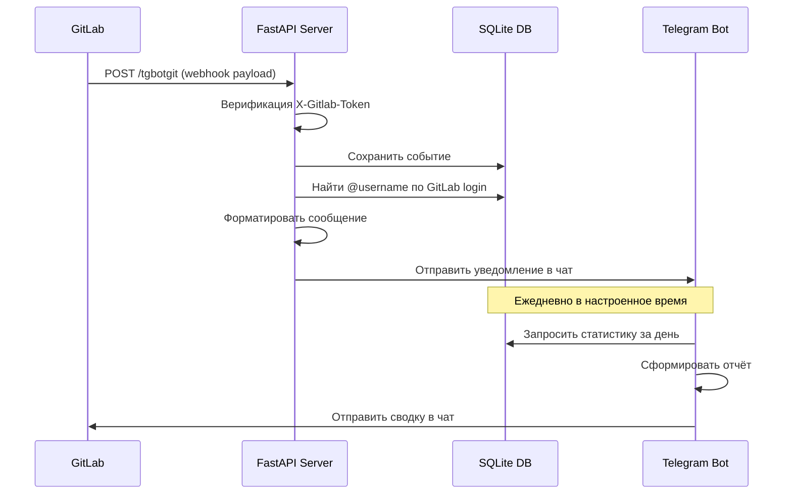

<div align="center">

# 🤖 GitLab → Telegram Notifier Bot

**Мост между GitLab и вашей командой в Telegram.**  
Получайте мгновенные уведомления о пушах, пайплайнах и задачах прямо в чат.

[](https://python.org)
[](https://fastapi.tiangolo.com)
[](https://aiogram.dev)
[](https://sqlite.org)

</div>

---

## ✨ Возможности

- 🚀 **Мгновенные уведомления** — push, merge request, pipeline, issue, комментарии, wiki
- 👤 **@Упоминания** — бот автоматически тегает нужного разработчика по GitLab username
- 📊 **Ежедневный отчёт** — статистика команды в настроенное время
- 🎛️ **Управление через Telegram** — команда `/tgbot` для настройки без редактирования файлов
- 🗄️ **SQLite база** — история всех событий и аналитика

---

## 🏗️ Как это работает



---

## 📁 Структура проекта

```
gitlab-telegram-bot/
│
├── main.py                    ← Точка входа. asyncio.gather(FastAPI + Bot + Scheduler)
├── requirements.txt           ← Зависимости Python
├── .env                       ← Конфигурация (не публиковать!)
├── .env.example               ← Шаблон конфигурации
├── bot.db                     ← SQLite база данных (создаётся автоматически)
├── ngrok.exe                  ← NGrok для туннелирования (опционально)
│
├── core/                      ← Ядро приложения
│   ├── config.py              ← Чтение настроек из .env
│   ├── bot.py                 ← Инициализация aiogram Bot + Dispatcher
│   ├── database.py            ← Вся работа с SQLite (users, events, settings)
│   └── scheduler.py          ← APScheduler для ежедневных отчётов
│
├── bot_commands/              ← Telegram-команды
│   └── handlers.py            ← /tgbot, inline-меню, FSM для диалогов
│
├── utils/                     ← Утилиты
│   └── formatters.py          ← Форматирование событий в Telegram-сообщения
│
├── tests/                     ← Тестирование
│   └── test_webhook.py        ← Ручной тест всех 8 типов событий
│
└── docs/                      ← Документация
    ├── quickstart.md          ← Быстрый старт
    ├── configuration.md       ← Справочник настроек
    ├── events.md              ← Поддерживаемые события GitLab
    ├── telegram-commands.md   ← Команды Telegram-бота
    ├── deployment.md          ← Развёртывание на сервере
    └── troubleshooting.md     ← Устранение неисправностей
```

---

## ⚡ Быстрый старт

```bash
# 1. Клонируйте репозиторий
git clone https://github.com/YOUR/gitlab-telegram-bot.git
cd gitlab-telegram-bot

# 2. Установите зависимости
pip install -r requirements.txt

# 3. Настройте .env
cp .env.example .env
# Заполните TELEGRAM_BOT_TOKEN, TELEGRAM_CHAT_ID, GITLAB_SECRET_TOKEN

# 4. Запустите
python main.py
```

Подробнее: [📖 Руководство по быстрому старту](./docs/quickstart.md)

---

## 📬 Поддерживаемые события GitLab

| Событие | Описание | Уведомление |
|---|---|---|
| `push` | Коммит в ветку | 🚀 Автор, ветка, список коммитов с файлами |
| `tag_push` | Новый тег / релиз | 🏷️ Тег, автор, сообщение |
| `merge_request` | Действие с MR | 🆕✅❌ Статус, ветки, инициатор |
| `pipeline` | CI/CD пайплайн | 🏁🚫 Статус, ветка, время выполнения |
| `issue` | Задача открыта/закрыта | 📕 Заголовок, описание |
| `note` | Комментарий | 💬 Текст, к какому объекту |
| `build` | Job CI/CD | ✅❌ Название задачи, время |
| `wiki_page` | Страница Wiki | 📖 Заголовок, автор |

Подробнее: [📖 Все события](./docs/events.md)

---

## 🎛️ Управление ботом

Напишите `/tgbot` в Telegram-чате — откроется панель управления:

| Кнопка | Действие |
|---|---|
| 📊 Статистика сейчас | Сводка за текущий день |
| 📜 Последние события | Последние 10 событий GitLab |
| 📅 Расписание | Изменить время ежедневного отчёта |
| 🔔 Типы событий | Вкл/Выкл каждый тип уведомлений |
| 👥 Участники команды | Список зарегистрированных пользователей |
| 🔗 Мой GitLab | Привязать GitLab username → @упоминания |

Подробнее: [📖 Команды бота](./docs/telegram-commands.md)

---

## ⚙️ Конфигурация

Минимальный `.env`:
```env
TELEGRAM_BOT_TOKEN=1234567890:AAExampleToken
TELEGRAM_CHAT_ID=1196267761
GITLAB_SECRET_TOKEN=MySecret123
APP_PORT=80
```

Подробнее: [📖 Справочник настроек](./docs/configuration.md)

---

## 🌐 GitLab Webhook

В настройках вашего GitLab репозитория (`Settings → Webhooks`):

| Поле | Значение |
|---|---|
| **URL** | `http://ВАШ_IP/tgbotgit` |
| **Secret token** | Значение `GITLAB_SECRET_TOKEN` из `.env` |
| **SSL verification** | Отключить, если нет HTTPS |

---

## 🚀 Развёртывание на сервере

| Вариант | Когда использовать |
|---|---|
| **systemd** | Linux-сервер с белым IP. Автозапуск и рестарт. |
| **NGrok** | Нет белого IP или тестирование. Быстро. |
| **Nginx proxy** | Уже есть Nginx, несколько сайтов на сервере. |

Подробнее: [📖 Руководство по развёртыванию](./docs/deployment.md)

---

## 🧪 Тестирование

```bash
python tests/test_webhook.py
```

Результат: 9 тестовых сообщений придут в Telegram.

Подробнее: [📖 Тестирование](./docs/testing.md)

---

## 🔧 Требования

```
Python     3.10+
FastAPI    0.110.0
uvicorn    0.27.1
aiogram    3.4.1
aiosqlite  0.20.0
apscheduler 3.10.4
python-dotenv 1.0.1
```

---

## 📚 Документация

| Раздел | Описание |
|---|---|
| [Быстрый старт](./docs/quickstart.md) | Запустить за 5 минут |
| [Конфигурация](./docs/configuration.md) | Все переменные окружения и настройки |
| [События GitLab](./docs/events.md) | Форматы и примеры всех уведомлений |
| [Команды бота](./docs/telegram-commands.md) | `/tgbot` и все пункты меню |
| [Развёртывание](./docs/deployment.md) | systemd, NGrok, Nginx |
| [Тестирование](./docs/testing.md) | Как прогнать тесты |
| [Устранение неисправностей](./docs/troubleshooting.md) | Типичные ошибки и решения |

---

## 📄 Лицензия

MIT — используйте, modifайте, распространяйте свободно.
